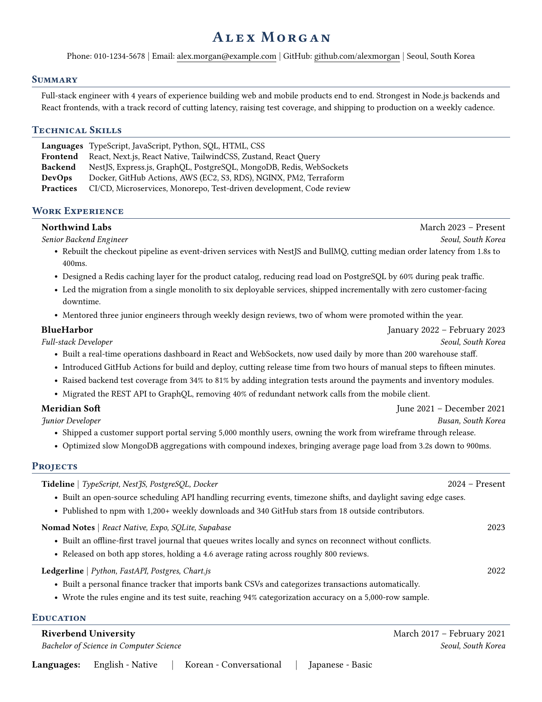
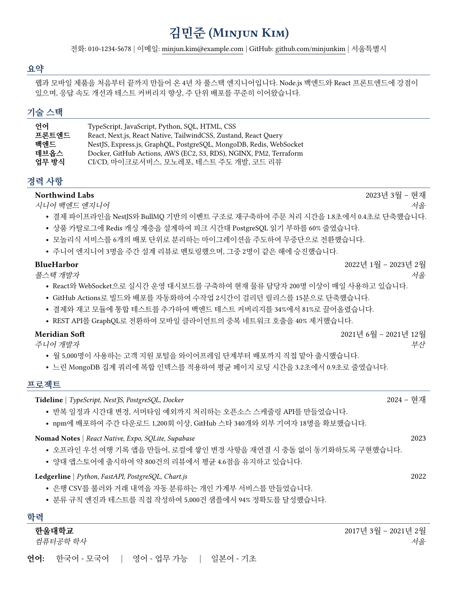

[English](README.md) | **O'zbekcha**

# LaTeX rezyume shablonlari (inglizcha va koreyscha)

Bir sahifali, ATS uchun mos LaTeX rezyume shablonlari. Ikkalasida ham namunaviy
ma'lumot bor, shuning uchun matnni almashtirib, dizaynni saqlab qolasiz.

- `english/` - inglizcha rezyume
- `korean/` - koreyscha rezyume, hangul qo'llab-quvvatlanadi

## Ko'rinishi

| Inglizcha | Koreyscha |
|---|---|
|  |  |

## Overleaf'da ochish (bir marta bosib)

[](https://www.overleaf.com/docs?snip_uri=https%3A%2F%2Fraw.githubusercontent.com%2Fviminizer%2Frez%2Fmain%2Foverleaf%2Fresume-template-english.zip&main_document=resume.tex)
[](https://www.overleaf.com/docs?snip_uri=https%3A%2F%2Fraw.githubusercontent.com%2Fviminizer%2Frez%2Fmain%2Foverleaf%2Fresume-template-korean.zip&main_document=resume.tex)

Overleaf shablonni o'zi yuklab oladi va loyihani yaratib beradi. Hech narsani
saqlash yoki yuklash shart emas.

Kompilyator **pdfLaTeX** bo'lib qolsin. U standart, va koreyscha shablon uni
talab qiladi.

## Yoki ZIP faylni o'zingiz yuklaysiz

O'sha fayllar [`overleaf/`](overleaf) papkasida turibdi:

1. `resume-template-english.zip` yoki `resume-template-korean.zip` ni yuklab oling.
2. Overleaf'da: **New Project** - **Upload Project**.

## Yoki kompyuteringizda kompilyatsiya qilasiz

pdfLaTeX va [Talablar](#talablar) bo'limidagi paketlar kerak bo'ladi. Keyin:

```bash
cd english   # yoki korean
pdflatex resume.tex
```

## Qanday tahrirlash

Matningiz `src/` ichida, har bir bo'lim alohida faylda:

| Fayl | Bo'lim |
|---|---|
| `src/heading.tex` | Ism va aloqa qatori |
| `src/summary.tex` | Qisqacha ma'lumot |
| `src/skills.tex` | Texnik ko'nikmalar |
| `src/experience.tex` | Ish tajribasi |
| `src/projects.tex` | Loyihalar |
| `src/education.tex` | Ta'lim |
| `src/languages.tex` | Tillar |

`resume.tex` va `custom-commands.tex` ga tegmang - dizayn o'sha yerda.
Bo'limlar tartibini o'zgartirish yoki birini olib tashlash uchun
`resume.tex` ichidagi `\input` qatorini ko'chiring yoki o'chiring.

Natija bir sahifada qolsin. Sig'may qolsa, shrift yoki chetlarni
o'zgartirishdan oldin ortiqcha bandlarni qisqartiring - dizayn allaqachon
sozlangan.

Ushbu repodagi shablonlarni o'zgartirsangiz, ZIP fayllarni qayta yaratish
uchun `./make-zips.sh` ni ishga tushiring.

## Nega shunday tanlangan

**Lato emas, Libertinus.** Lato `fi` va `fl` harflarini bitta belgiga
qo'shib yuboradi. Shuning uchun `workflow` va `config` kabi so'zlar PDF'dan
`workflow` va `config` bo'lib chiqadi, kalit so'z bo'yicha qidiruv ularni
topmaydi. Libertinus oddiy harflarni yozadi.

**Ikonkalar yo'q.** FontAwesome belgilari matn sifatida keraksiz belgilarga
(`#`, `§`) aylanadi. Shuning uchun har bir maydonda oddiy matnli yorliq bor.

**Koreyscha matn uchun Nanum Myeongjo.** Bu serif shrift, shuning uchun
ikkala yozuv aralashgan qatorlarda Libertinus bilan mos tushadi.

**Harflar orasi faqat inglizcha shablonda kengaytirilgan.** `kotex` yuklanganda
microtype'ning `\textls` buyrug'i matn chiqarishni buzadi - ism
`M i n j u n K i m` bo'lib chiqadi. Shuning uchun koreyscha shablonda
ishlatilmagan.

Bularning hammasi tayyor PDF'larda `pdftotext` bilan tekshirilgan, taxmin
qilinmagan. O'z tahrirlaringizni ham xuddi shunday tekshirishingiz mumkin:

```bash
pdftotext resume.pdf - | less
```

Kalit so'z u yerda noto'g'ri ko'rinsa, ATS ham uni noto'g'ri ko'radi.

## Talablar

pdfLaTeX va quyidagi TeX Live paketlari: `libertinus-type1`, `kotex`,
`nanumtype1` (faqat koreyscha uchun), `microtype`, `titlesec`, `enumitem`,
`fancyhdr`.

Minimal TeX o'rnatmasida (TinyTeX, BasicTeX) ularni shunday o'rnatasiz:

```bash
tlmgr install libertinus-type1 kotex-utf nanumtype1 microtype titlesec enumitem fancyhdr
```

## Litsenziya

MIT. Audric Serador'ning rezyumesi asosida, u esa
[sb2nov/resume](https://github.com/sb2nov/resume) ga asoslangan.
